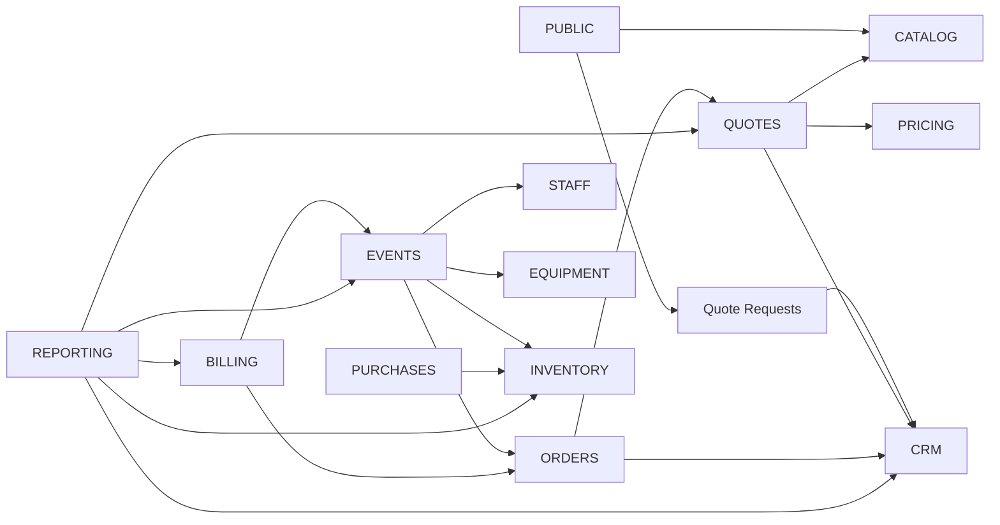

# Architecture globale — WATO EVENTS

## 1. Décision d'ensemble

WATO EVENTS adopte un **monolithe Flask modulaire** : une seule application et une seule base MySQL pour le MVP, avec séparation stricte des domaines dans le code. Aucun microservice, Redis, Celery, Docker ou Kubernetes n'est requis pour fonctionner sur PythonAnywhere.

Le socle existant `create_app()`, `extensions.py`, Flask-SQLAlchemy, Flask-Migrate et CSRF est conservé.

## 2. Architecture fonctionnelle

| Domaine | Responsabilité | Entités principales | Dépendances / interactions |
|---|---|---|---|
| Public / Marketing | acquisition, SEO, catalogue public, galerie | Service, Menu, Pack, Dish, GalleryItem, BusinessSettings | Catalog, Quotes, Settings |
| Authentification | connexion, session, récupération accès | User | RBAC |
| Utilisateurs / RBAC | comptes internes et autorisations | User, Role, Permission | tous modules privés |
| CRM Prospects | demandes non converties, suivi commercial | Prospect, QuoteRequest | Quotes, Customers |
| Clients | référentiel clients | Customer | Quotes, Orders, Events, Billing |
| Catalogue | offres vendables | Service, Dish, Menu, MenuItem, Pack | Public, Quotes, Pricing |
| Demandes de devis | besoin brut du visiteur/prospect | QuoteRequest | CRM, Catalog |
| Devis | proposition commerciale versionnée | Quote, QuoteItem | CRM, Catalog, Pricing, Orders/Events |
| Commandes | engagement commercial exécutable | Order, OrderItem | Customers, Quotes, Billing |
| Événements | exécution logistique événementielle | Event, EventType | Orders, Staff, Equipment, Inventory |
| Paiements | encaissements | Payment | Orders/Events, Invoices |
| Factures | documents financiers | Invoice, InvoiceItem | Customers, Orders/Events, Payments |
| Stocks | ledger matières | Ingredient, StockMovement | Purchases, Events |
| Fournisseurs / Achats | approvisionnement | Supplier, Purchase, PurchaseItem | Inventory |
| Matériel | parc et réservations | Equipment, EquipmentReservation | Events |
| Personnel | ressources humaines opérationnelles | Employee, EventAssignment | Events |
| Planning | disponibilité et conflits | Event, Employee, EquipmentReservation | Events, Staff, Equipment |
| Galerie | réalisations publiques | GalleryItem | Public |
| Notifications | notifications internes/externes abstraites | Notification | plusieurs domaines |
| Rapports | agrégats lecture seule | projections/requêtes | tous domaines métier |
| Paramètres | identité et règles configurables | BusinessSettings | Public, Documents, Notifications |
| Audit | traçabilité actions sensibles | AuditLog | tous domaines privés |

## 3. Arborescence cible

La structure ci-dessous est **cible** et doit être créée progressivement, uniquement au sprint qui en a besoin.

```text
app/
  __init__.py
  extensions.py

  models/
    auth.py
    crm.py
    catalog.py
    quotes.py
    orders.py
    events.py
    billing.py
    inventory.py
    equipment.py
    staff.py
    settings.py
    audit.py

  blueprints/
    public/
    auth/
    admin/
    crm/
    catalog/
    quotes/
    orders/
    events/
    billing/
    inventory/
    equipment/
    staff/
    reports/
    settings/

  services/
    pricing.py
    quote.py
    order.py
    event.py
    payment.py
    invoice.py
    inventory.py
    equipment.py
    notification.py
    document.py
    reporting.py
    numbering.py
    audit.py

  forms/
  templates/
    public/
    auth/
    admin/

  static/
    css/
    js/
    images/
    uploads/

  utils/
    money.py
    time.py
    files.py
    permissions.py
    enums.py

tests/
  unit/
  services/
  routes/
  permissions/
  integration/

migrations/
docs/
```

## 4. Dépendances entre modules



Règle : les modules de reporting lisent plusieurs domaines mais les domaines métier ne dépendent jamais du reporting.

## 5. Commande vs événement

**Décision : deux entités différentes.**

- `Order` représente l'engagement commercial à livrer des biens/services.
- `Event` représente une exécution nécessitant planification opérationnelle, lieu, horaires, matériel ou personnel.
- Une commande de livraison simple peut ne pas avoir d'événement.
- Un mariage peut être associé à une commande et à un événement.
- Une relation `Order 0..1 -> Event` suffit pour le MVP. Si plus tard une commande doit couvrir plusieurs événements, une migration pourra généraliser la relation.

Cette séparation évite de forcer toute vente dans un modèle logistique complexe.

## 6. User vs Employee

- `User` = identité numérique pouvant se connecter au back-office.
- `Employee` = personne mobilisable sur les prestations.
- Un employé peut exister sans compte utilisateur.
- Un utilisateur administratif peut ne jamais être affecté à un événement.
- Lien optionnel `Employee.user_id -> User.id`.

## 7. Services métier

Les routes Flask restent minces. Les services portent les règles métier et les transactions :

- `PricingService` : calcul des prix ;
- `QuoteService` : création, modification, envoi, acceptation ;
- `OrderService` : création depuis devis ou commande directe ;
- `EventService` : planification et changements d'état ;
- `PaymentService` : enregistrement et affectation d'encaissements ;
- `InvoiceService` : émission et statut des factures ;
- `InventoryService` : mouvements et disponibilité stock ;
- `EquipmentService` : réservations et conflits ;
- `NotificationService` : abstraction email/WhatsApp/SMS ;
- `DocumentService` : devis/factures/reçus/listes PDF ;
- `ReportingService` : agrégats en lecture ;
- `NumberingService` : numéros commerciaux atomiques ;
- `AuditService` : journalisation sensible.

## 8. Frontières transactionnelles

Une transaction DB unique doit couvrir les opérations atomiques suivantes :

- acceptation d'un devis + création de commande ;
- création/confirmation d'un événement et réservations critiques ;
- enregistrement paiement + mise à jour état financier dérivé ;
- validation d'achat + mouvements de stock ;
- correction/inventaire + mouvements associés ;
- réservation matériel avec contrôle de disponibilité ;
- émission de facture + attribution numéro commercial.

Aucun commit ne doit être effectué au milieu d'une opération métier atomique.

## 9. Suppressions

Hard delete réservé aux données non utilisées et sans valeur historique.

Archivage/soft delete ou statut obligatoire pour : clients utilisés, devis envoyés, commandes, événements, paiements, factures, mouvements de stock, réservations terminées et audits.

Les objets financiers et de traçabilité ne doivent pas être supprimables par l'interface standard.

## 10. Statuts

Les statuts sont centralisés dans des enums/constants et validés par les services.

- Quote : BROUILLON → ENVOYE → ACCEPTE / REFUSE / EXPIRE / ANNULE
- Order : BROUILLON → CONFIRMEE → PREPARATION → PRETE → LIVREE/TERMINEE ; annulation contrôlée
- Event : PLANIFIE → CONFIRME → PREPARATION → EN_COURS → TERMINE ; ANNULE selon règles
- Invoice : BROUILLON → EMISE → PARTIELLEMENT_PAYEE → PAYEE ; ANNULEE/AVOIR selon futur besoin
- Payment : EN_ATTENTE → VALIDE ; ECHEC / ANNULE / REMBOURSE
- EquipmentReservation : PROVISOIRE → CONFIRMEE → EN_UTILISATION → RETOURNEE ; ANNULEE

## 11. Numérotation

Les identifiants DB restent techniques. Les références commerciales suivent un compteur annuel transactionnel :

- DEV-2026-0001
- CMD-2026-0001
- EVT-2026-0001
- FAC-2026-0001

Le `NumberingService` verrouille ou met à jour atomiquement la séquence par type + année afin d'éviter les collisions concurrentes.

## 12. Prix

Tous les montants utilisent `Decimal` en Python et `NUMERIC/DECIMAL` en MySQL.

Un `QuoteItem`/ `OrderItem` doit capturer un **snapshot commercial** : libellé, quantité, unité, prix unitaire, remise, taxe, total. Il ne faut pas recalculer un ancien devis depuis le prix actuel d'un plat.

Le `PricingService` orchestre : prix plat/menu/pack, prix par personne, quantité, personnel, matériel, transport, options, remises et taxes.

## 13. Stock

Le stock est un ledger. La source de vérité est `StockMovement` avec types : PURCHASE, CONSUMPTION, ADJUSTMENT, LOSS, RETURN, INVENTORY_CORRECTION.

Le disponible peut être calculé par somme des mouvements ; pour la performance, un solde cache pourra être ajouté plus tard mais devra être réconciliable avec le ledger.

## 14. Matériel

`Equipment` conserve le parc physique. `EquipmentReservation` réserve une quantité pour un événement sur une fenêtre temporelle.

Disponibilité conceptuelle :

`disponible = total - réservé_actif - en_utilisation - endommagé - maintenance`

Les états ne doivent pas être dupliqués sans source claire : les réservations portent le réservé/en utilisation ; les compteurs endommagé/maintenance peuvent être portés par l'équipement ou par mouvements d'état selon le niveau de détail futur.

## 15. Fichiers

Pour le MVP PythonAnywhere : stockage local organisé par catégories `dishes/`, `gallery/`, `logos/`, `events/`, `documents/`.

Le code doit passer par une abstraction de stockage afin de permettre un remplacement futur par un backend cloud sans modifier la logique métier.

## 16. Notifications

`NotificationService` expose une interface commune avec canaux EMAIL, WHATSAPP, SMS et INTERNAL. Les fournisseurs externes ne sont pas intégrés pendant ce sprint.

## 17. Site public et SEO

Le public lit le catalogue publié et la galerie sans accéder aux modèles internes sensibles. Les pages publiques utiliseront URLs propres, metadata SEO, Open Graph et futur sitemap. Les actions d'administration sont séparées dans des Blueprints privés.

## 18. PythonAnywhere

Architecture compatible avec Flask WSGI, MySQL, virtualenv, statiques et uploads locaux. Aucun composant distribué obligatoire.
