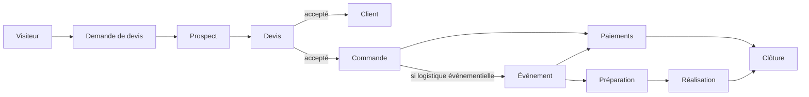
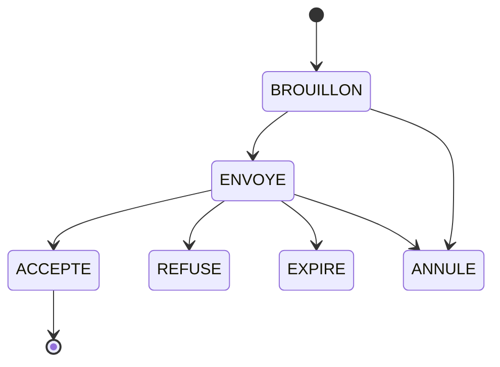
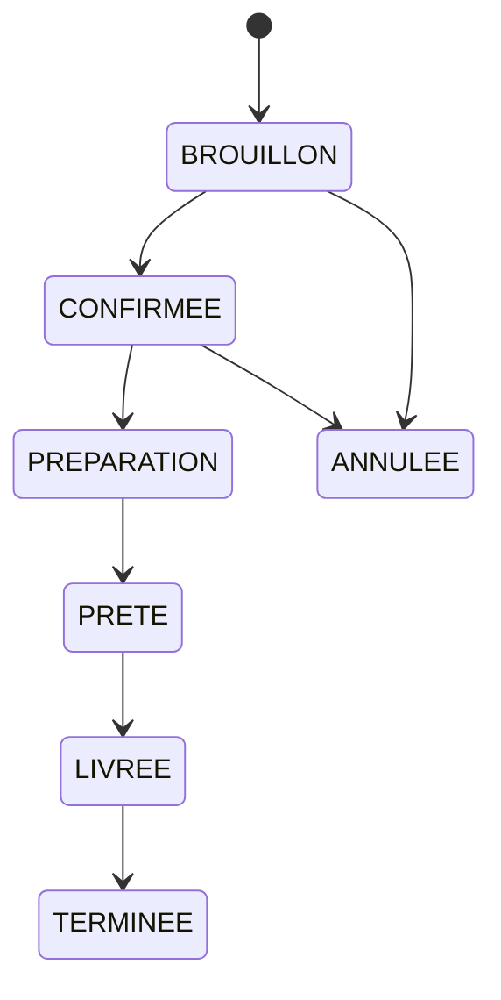
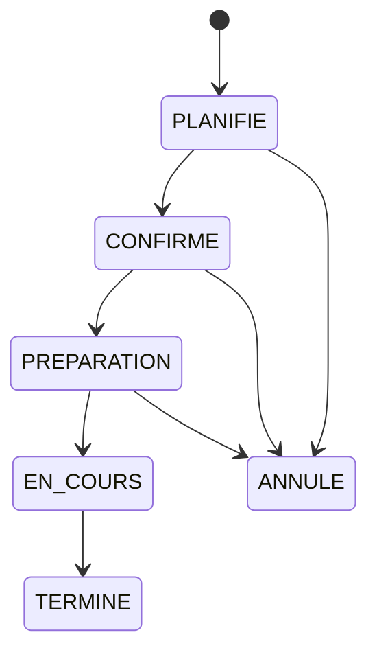
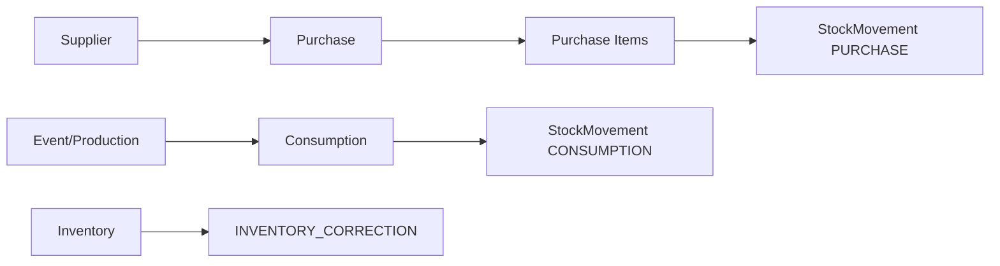

# Flux métier — WATO EVENTS

## 1. Flux commercial principal

## 2. Concepts à ne pas confondre

### QuoteRequest
Expression brute du besoin. Peut être incomplète, indicative et non contractuelle.

### Quote
Proposition commerciale officielle de WATO EVENTS, avec prix figés, validité, conditions et statut.

### Order
Engagement commercial confirmé à exécuter. Peut provenir d'un devis accepté ou d'une commande directe autorisée.

### Event
Objet opérationnel de planification : lieu, date, horaires, matériel, personnel, préparation et exécution.

Une livraison de repas peut être une `Order` sans `Event`. Un mariage est généralement `Order + Event`.

## 3. Flux devis

Lors de l'acceptation, une transaction doit :

1. valider que le devis est encore acceptable ;
2. figer son état ;
3. créer la commande associée ;
4. créer l'événement seulement si requis ;
5. journaliser l'action.

## 4. Flux commande

## 5. Flux événement

Les transitions tardives doivent appliquer des règles renforcées, car elles peuvent impacter achats, personnel, matériel ou paiements.

## 6. Flux paiement

Un paiement ne signifie jamais automatiquement que la commande ou l'événement est soldé.

`solde = total_du_document_de_reference - somme_des_paiements_valides`

Les statuts financiers sont dérivés du total et des paiements valides.

## 7. Flux achat et stock

Aucune opération stock métier ne modifie silencieusement une quantité sans mouvement traçable.

## 8. Flux matériel

Réservation provisoire → contrôle disponibilité → confirmation → utilisation → retour → libération.

Les conflits sont vérifiés sur l'intervalle temporel et la quantité disponible.

## 9. Flux personnel

Affectation seulement après contrôle de disponibilité. Une mission porte rôle opérationnel, horaires et coût éventuel.
