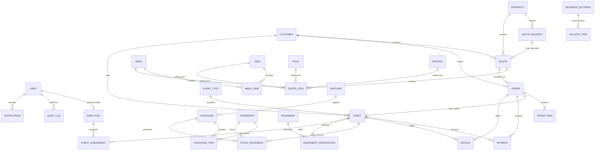

# ERD global — WATO EVENTS

Ce diagramme décrit le modèle relationnel cible. Il est volontairement lisible et n'affiche que les relations structurantes.

## Clés et contraintes structurantes

Les PK utilisent des identifiants techniques internes. Les références commerciales restent séparées et uniques.

FK importantes :

- `Quote.customer_id` ou `Quote.prospect_id` selon le stade commercial ;
- `Quote.quote_request_id` optionnel ;
- `Order.quote_id` optionnel mais unique si une acceptation crée une seule commande ;
- `Event.order_id` optionnel et unique pour le MVP ;
- `Payment.event_id` / `Payment.order_id` selon le contexte ;
- `EquipmentReservation.event_id` et `equipment_id` ;
- `EventAssignment.event_id` et `employee_id` ;
- `StockMovement.ingredient_id` obligatoire.

Contraintes recommandées :

- références commerciales uniques ;
- quantité strictement positive sur lignes de vente/achat ;
- montant non négatif sauf lignes/mouvements explicitement signés ;
- dates de fin >= dates de début ;
- unicité logique sur certaines affectations événement/personnel ;
- index sur statuts, dates d'événements, FK, références commerciales et dates de création.
