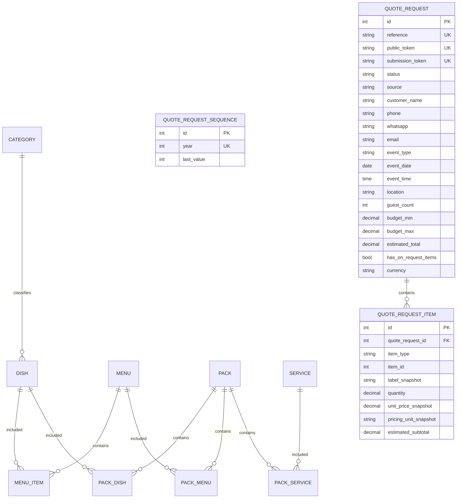
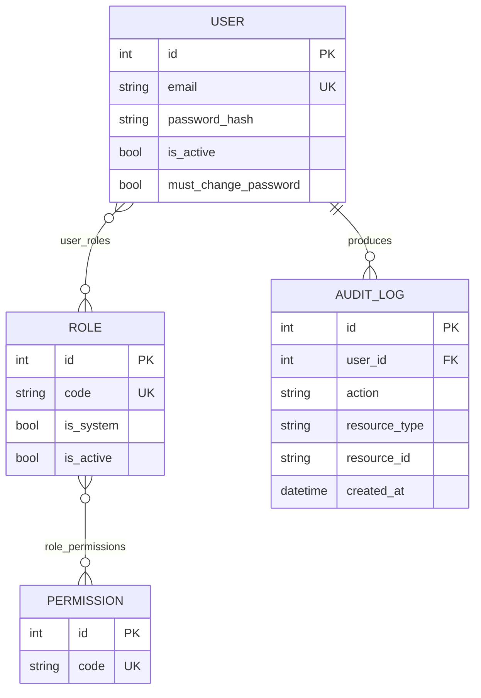

# ERD — DNP DECO

## Domaines réellement implémentés après PROMPT 4

## Référence catalogue dans QuoteRequestItem

`item_type + item_id` identifie l'élément catalogue sélectionné, sans FK polymorphique. Les snapshots conservent le libellé, le prix et l'unité utilisés au moment de la demande.

## Non implémenté

`Quote`, `QuoteItem`, `Prospect`, `Customer`, `Order`, `Event`, `Payment` et les domaines opérationnels restent futurs.

## Authentification/RBAC — implémenté au PROMPT 5

User est un compte d’accès applicatif. **User ≠ Employee** ; Employee reste futur au PROMPT 12.
