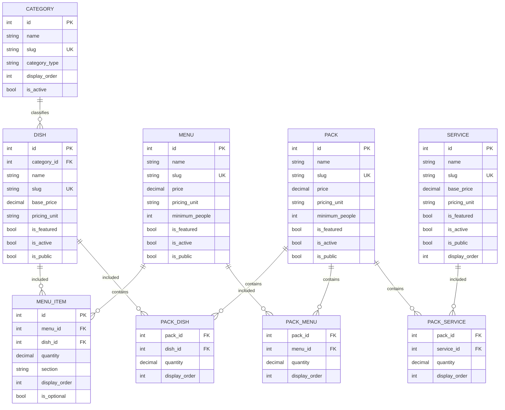

# ERD — WATO EVENTS

## Domaine réellement implémenté au PROMPT 3

## Domaines futurs

Les entités QuoteRequest, Quote, Order, Event, Payment, Invoice, Inventory, Equipment, Employee et autres restent conceptuelles et ne sont pas encore présentes dans la base.

Le futur `QuoteItem` pourra référencer une entité catalogue puis capturer un snapshot commercial sans dépendre du prix courant.
